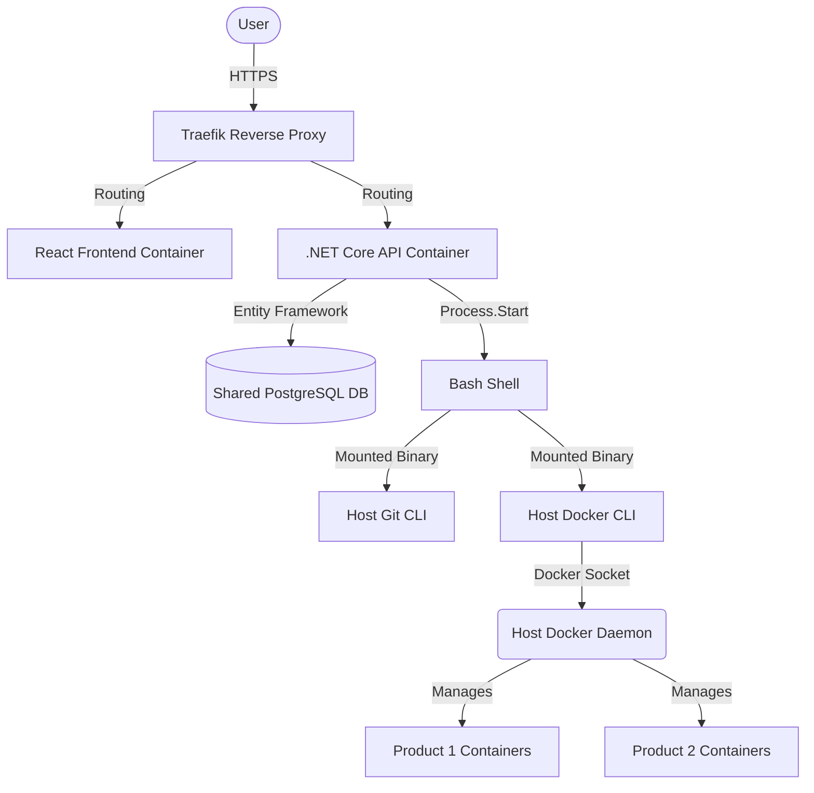
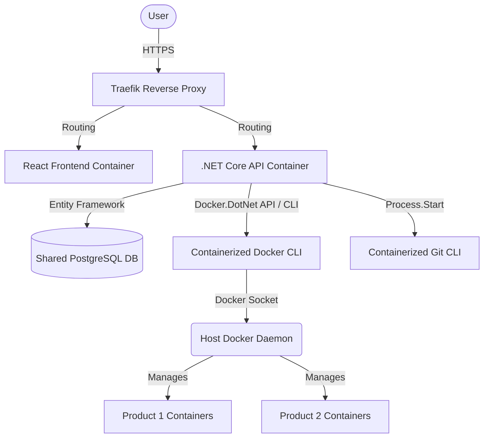

# Technical Architecture

## Current Architecture



## Proposed Architecture



## Backend Modules
- **API Controllers**: `DeployController`, `DatabaseController`, `MonitoringController`, `AuthController`.
- **Infrastructure Services**: `DeployService` (executes shell commands), `MonitoringService` (fetches stats).
- **Data Access**: Entity Framework Core with `Npgsql`.
- **Background Jobs**: Quartz.NET for scheduled tasks.

## Frontend Modules
- **React/Vite**: SPA.
- **Routing**: `react-router-dom`.
- **State/API**: Standard React components communicating via Axios/Fetch.

## Host Command Execution Strategy Analysis

### Current Strategy: Host Binary Mounting
Currently, the `docker-compose.yml` mounts host binaries:
```yaml
- /usr/bin/docker:/usr/bin/docker
- /usr/bin/git:/usr/bin/git
- /var/run/docker.sock:/var/run/docker.sock
```
**Pros**: Quick to set up.
**Cons**: Highly unstable. Host binaries rely on host-specific dynamically linked libraries (e.g., `glibc`). If the host OS (e.g., Ubuntu) and container base image (e.g., Debian/Alpine) differ, the binaries will fail to execute with "file not found" or "segmentation fault" errors.

### Alternative Strategies

1. **Host Agent Strategy**:
   - Run a lightweight agent (Go/Python) directly on the host OS.
   - DevOps Manager communicates with the agent via HTTP/gRPC.
   - **Pros**: Cleanest separation.
   - **Cons**: Requires installing and managing software directly on the VPS host.

2. **SSH-to-Host Strategy**:
   - The DevOps container SSHs into the host (via `host.docker.internal` or host IP) to execute commands.
   - **Pros**: Secure, uses host environments accurately.
   - **Cons**: Requires managing SSH keys and adding overhead to every command.

3. **Restricted Command Executor Strategy (Recommended)**:
   - Mount `/var/run/docker.sock`.
   - Mount project directories (e.g., `/var/www`).
   - **Crucial Fix**: Install `docker-cli` and `git` *inside* the DevOps API `Dockerfile` during the build stage.
   - Execute commands using the container's native `git` and `docker` CLI tools which interact with the host via the mounted Docker socket and mounted folders.
   - **Pros**: Production-safe, portable, doesn't break due to library mismatches.
   - **Cons**: Container size increases slightly.

## Database Schema Model
Uses a common PostgreSQL instance. 
- `Projects`, `ProjectServices`: Stores environment config.
- `DeploymentLogs`: Stores outputs of deployments.
- `Users`, `Roles`: Identity management.

## Security & RBAC Model
- Identity via JWT.
- Roles defined in the database (e.g., SuperAdmin, DevOpsAdmin).
- Commands are not arbitrary. Only specific bash sequences are built in the backend (e.g., `git checkout {branch} && docker compose build`).

## Deployment Architecture on Hostinger
- **VPS Host**: Runs Traefik as the main entrypoint.
- **DevOps Manager**: Runs alongside Traefik on a dedicated subdomain (`devops-api.tmkcomputers.in`).
- **Target Products**: Run on the same VPS, exposed via Traefik labels.
