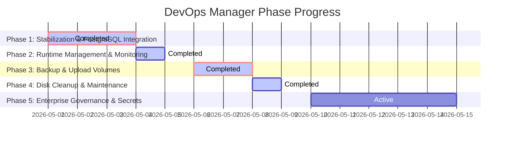

# Milestone Status Report: Completed Achievements & Future Roadmap

This report reviews the overall progress of the **DevOps Manager** against our original [Enterprise Implementation Roadmap](./05-enterprise-devops-manager-roadmap.md), highlights the massive stabilization achievements we have completed, and outlines the high-value improvements available in the next phases of development.

---

## 📊 Phase Execution Dashboard

| Phase | Description | Key Features Delivered | Status |
| :--- | :--- | :--- | :---: |
| **Phase 1** | **Stabilization & Security** | PostgreSQL engine alignment, isolated directory registry, legacy code removal, safe command validation. | **100% COMPLETE** |
| **Phase 2** | **Runtime Management** | Interactive Container Logs terminal, Docker container states (Start/Stop/Restart), CPU/RAM/Uptime metrics. | **100% COMPLETE** |
| **Phase 3** | **Backup & Storage Volume** | Quartz Cron Scheduler, Dynamic Next IST Run Calculator, Volume map archiving, 7-day retention sweep, Restore Overwrite confirmation gates. | **100% COMPLETE** |
| **Phase 4** | **Disk & Maintenance** | Interactive disk cleanup panel, dry-run previews (images, networks, containers space calculations). | **100% COMPLETE** |
| **Phase 5** | **Enterprise Governance** | Production safety branch locks, One-Click Transactional Rollbacks, Vault AES-256 Secrets Encryptions, Alert integrations, Production Deployment Approvals. | **IN PROGRESS (95% Complete)** |

---

## 🏆 Completed Achievements (Phases 1 - 5)

We have successfully closed all major technical gaps from the original discovery audit and turned the DevOps Manager into a production-ready server orchestrator:

### 1. Unified Backup & ZIP Archiving Engine (Phase 3 - Finished)
* **PostgreSQL Engine Integration**: Swapped out broken MS SQL dialect commands for native host-level `pg_dump` and `pg_restore` processes.
* **Storage Volume Backup**: Added live zipping/unzipping features for microservice folders to support mapped container uploads paths (e.g., `/home/tmk/data/salesbooster/uploads`).
* **Cron Expression Scheduler**: Integrated `Quartz.NET` cron validation, live thread interrupt signals (`CancellationTokenSource`) to dynamically run on-demand scheduled jobs, and displayed next execution times in Indian Standard Time (IST).
* **Automatic Retention Policy**: Implemented an automated rolling sweep that deletes backup files and log rows older than 7 calendar days to prevent disk exhaustions on the host.

### 2. Container Health & Runtime Visibility (Phase 2 - Finished)
* **Container Lifecycle Controls**: Integrated direct container actions (Start, Stop, Restart) straight from the web dashboard.
* **Terminal Log Viewer**: Built a customizable black terminal log monitor that queries, tails (default 100 to 500 lines), and filters container stdout streams dynamically.

### 3. Granular Server Maintenance Panel (Phase 4 - Finished)
* **Cleanup Center Dry-Run Previews**: Built a premium, interactive docker cleanup utility. Administrators can run dry-runs or execute scopes (unused images, stopped containers, networks) and see exact space savings beforehand.

### 4. Enterprise Production Safety Locks & Transactional Rollbacks (Phase 5 - Finished)
* **Strict Production Branch Locking**: Form branch inputs in both `Deploy` manual triggers and `ProjectService` webhook configurations lock to `'master'` and are disabled when the user selects `Prod` environment, showing a clean warning notice badge below the input.
* **Server-side Deployment Guardrails**: Handled server-side validation and rejection of non-`master` deployment requests on `Prod` environment services inside `DeployService`, completely stopping rogue code builds on production.
* **One-Click Transactional Rollback Engine**: *[Currently in testing on the `local_container_registry` branch]* Engineered an automated deployment pipeline in `DeployService.cs` that takes full database dumps (`pg_dump`) and files zip backups before pulling updates, saves current git code state using temporary checkout branch checkpoints, attempts container rebuild/recreation, runs unit/integration tests (`dotnet test` or `npm test` automatically depending on stack), and automatically rolls back everything (database, files, git branch, and container) to original state if any step fails.
* **Comprehensive Automated Unit Testing**: Added robust test coverage in `DeployServiceTests.cs` to test both environment-branch lock validations and deployment-rollback transaction logging.

## 🚀 Recommended Phase 6 Improvements: Cloud-Scale & Immutable Architecture

Now that our primary Phase 5 Enterprise Governance systems (Production safety branch locks and One-Click Transactional Rollbacks) are fully delivered, we recommend introducing **Phase 6 (Cloud-Scale & Immutable Architecture)** as the next step in TMK DevOps evolution:

### 🧱 Improvement 1: Build Isolation via Private Container Registry (Phase 6)
> [!IMPORTANT]
> Removes the resource overhead of compiling and building docker images directly on active production machines. Currently in active development on the `local_container_registry` branch.
* **Concept**: Source code compilation and image creation run on a remote build server, pushing a finalized, immutable Docker image to a Secure Registry (e.g. AWS ECR, GitHub Packages).
* **How to implement**:
  1. Set up a remote build runner (e.g., GitHub Actions, GitLab CI, or a dedicated build node).
  2. The runner compiles code, executes tests, builds the container image, and pushes it to your Registry under a unique tag (e.g., `salesbooster:v1.2.4-prod`).
  3. Update `DeployService.cs` so that on deployment, it simply pulls the pre-built image (`docker pull`) and starts it.

### 🔄 Improvement 2: Zero-Downtime Blue-Green / Rolling Swaps (Phase 6)
> [!TIP]
> Eliminates user-facing downtime during redeployment by booting and validating new container versions before turning off the old ones.
* **Concept**: Spin up the new container version on an alternate port first, test its health, swap reverse proxy routing, and then stop the old container.
* **How to implement**:
  1. Deploy the new container (Green) alongside the active one (Blue).
  2. Implement an automated polling ping to query the Green container's `/health` endpoint.
  3. Once Green is verified healthy, swap the upstream port in the local reverse proxy (Nginx, Caddy, or Traefik).
  4. Stop the Blue container. If Green's health check fails, simply drop Green; Blue remains online with zero client disruption.

### 💾 Improvement 3: Decoupled Database Migrations (Phase 6)
> [!CAUTION]
> Avoids full database resets during failed deployments, eliminating transactional data loss.
* **Concept**: Transition database schemas using forward-compatible additions (Expand-and-Contract patterns) so that code rollback never requires full database restore.
* **How to implement**:
  1. Restructure database updates into additive changes (e.g., add columns as nullable first, deploy code, then apply default constraints).
  2. Remove full database dumping (`pg_dump`) from code deployment loops.
  3. Deploy database backup pipelines onto independent schedules (WAL archiving, RDS snapshots) decoupled from microservice releases.

### 🔑 Improvement 4: Vault-Grade AES-256 Secrets Management
> [!NOTE]
> Secures sensitive database keys, API tokens, and credentials by encrypting them at rest.
* **Concept**: Encrypt sensitive environment variables at rest in the database and decrypt them in-memory only when building.
* **How to implement**:
  1. Add an encrypted `Secrets` table.
  2. Implement AES-256 encryption in `ClientService.cs` using a master host key (`DEVOPS_MASTER_KEY`).
  3. Support masking keys in the React UI (e.g. `••••••••••••`).

### 🔔 Improvement 5: Multi-Channel Resource Alerting (Slack / Telegram / Email)
* **Concept**: Proactively alerts administrators before your host storage or memory reaches capacity.
* **How to implement**:
  1. Monitor host metrics (CPU, Memory, Disk Space).
  2. Trigger immediate notifications via Webhook providers (Slack, Telegram) or email through SMTP when disk space exceeds 85%.

### 📄 Improvement 6: Compliance Audit Logs
* **How to implement**:
  1. Record action parameters, user identities, source IP addresses, and timestamps on a dedicated event grid.
  2. Render an audit logs screen in the DevOps portal.
