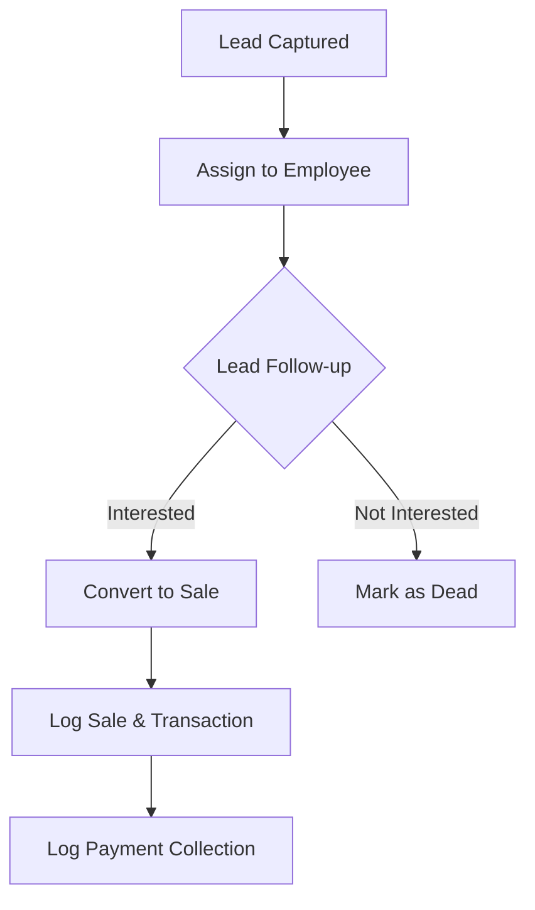

# Business Requirement Document (BRD)
## Sales Booster CRM

### 1. Document Information
- **Product Name**: Sales Booster CRM
- **Version**: 1.0
- **Prepared For**: Internal Product and Implementation Team
- **Technology**: .NET Core 8 API + React Vite Web + React Native (Expo) Mobile App

### 2. Executive Summary
Sales Booster CRM is a comprehensive software platform designed to manage end-to-end sales processes, employee attendance, field-force tracking, and basic HR workflows. It solves the business problem of fragmented sales tracking, lack of visibility into field employee movement, and unstructured customer follow-ups. The target users are sales teams, field service agents, HR managers, and business owners. It provides business value by offering a unified view of organizational performance and boosting sales team productivity.

### 3. Business Objectives
- Improve sales tracking and pipeline visibility.
- Improve lead follow-up and status management.
- Improve customer (Client) management.
- Improve sales team productivity through field tracking (geo-location & selfies) and real-time chat.
- Improve management visibility through comprehensive dashboards.
- Reduce manual Excel-based tracking for sales and attendance.

### 4. Stakeholders
- **Business Owner**: Requires high-level dashboards and reporting.
- **Sales Manager**: Needs to track team targets, daily activities, and lead conversions.
- **Sales Executive**: Needs an easy interface to log sales, check-in/out, and communicate.
- **Admin**: Needs to configure RBAC, modules, and system settings.
- **HR/Support Team**: Needs to manage leaves, shifts, and salary generation.
- **Implementation & Dev Team**: Needs clear documentation to maintain and deploy.
- **QA Team**: Needs structured test plans to ensure product reliability.

### 5. Target Users and Personas
- **CRM Admin**: Configures system settings, creates users, roles, and sets up business units.
- **Sales Manager**: Views aggregate data, tracks team locations, reviews exception logs.
- **Sales Executive**: Logs daily activities, captures leads, updates statuses, records collections.
- **Business Owner/Director**: Views organization-wide performance and sales targets vs actuals.

### 6. Existing System Understanding (From Code)
**Found in Code:**
- **HR & Field Tracking**: Detailed Employee entity tracking location, selfies, EOD updates. Shift and Leave Policy systems. Automated jobs for Daily Attendance generation.
- **Sales & Targets**: Target setting (MonthlySalesTarget, MonthlyCollectionTarget), Sales tracking, Collections against sales.
- **Lead Tracking**: Lead capture with categorization, assignment to employees and business units.
- **Communication**: Complex chat system with Workspaces, Channels, Threads/Reactions, and Pinned messages.
- **Hierarchy**: Multi-level organizational structure (Business Unit -> Division -> Department).

**Assumptions:**
- The chat system is meant to replace third-party tools like Slack/WhatsApp for internal teams.
- Field agents heavily rely on the Mobile App for daily check-ins (GPS/Selfie) and quick logging of Leads/Sales.

**Missing Areas (Compared to full CRM):**
- Pipeline/Deal Management (Kanban view, Deal Stages).
- Built-in Quote & Invoice generation.
- External Email/Calendar sync (GSuite/O365 integration).
- Automated Drip Campaigns or Marketing Automation.
- Offline Sync capability in the Mobile App for remote areas.

### 7. Functional Requirements Module-wise

#### 7.1 Employee & User Management
- **Purpose**: Manage platform users and their reporting hierarchy.
- **Functional Requirements**: Ability to add users, link them to employees, define managers, set joining/resignation dates.
- **Business Rules**: An employee must be linked to an Identity User. Manager hierarchy can be nested.

#### 7.2 Lead Management
- **Purpose**: Capture and manage prospective clients.
- **Business Users**: Sales Executives, Sales Managers.
- **Input Fields**: Name, Address, Mobile, Email, Lead Category, Assigned Employee, Business Unit.
- **Business Rules**: Leads must be assigned to an employee and a Business Unit.
- **Status Changes**: Tracked via `LeadStatus` enum (New, etc.).

#### 7.3 Attendance & Leave Management
- **Purpose**: Track field-force daily hours and location.
- **Functional Requirements**: Check-in/Check-out with GPS coordinates. Selfie validation. Apply for leaves.
- **Workflow**: Check-in -> (Optional EOD Update) -> Check-out -> Background job calculates Late/Early marks.

#### 7.4 Target & Sales Management
- **Purpose**: Track employee performance against goals.
- **Business Users**: Sales Managers, Sales Executives.
- **Functional Requirements**: Set monthly product-wise sales targets. Log actual sales transactions. Track payment collections.

#### 7.5 Internal Communication (Chat)
- **Purpose**: Real-time team collaboration.
- **Functional Requirements**: Create workspaces and channels. Send text and attachments. Read receipts. Mention users.

#### Standard CRM Module Status
- **Lead Management**: Partially Implemented
- **Contact Management**: Implemented (Clients entity)
- **Company/Account Management**: Implemented
- **Opportunity/Deal Management**: Missing
- **Sales Pipeline**: Missing
- **Follow-up Management**: Missing / Unknown (No direct Follow-Up entity found)
- **Task Management**: Implemented
- **Quotation/Proposal Management**: Missing
- **Product/Service Catalogue**: Implemented
- **Campaign Management**: Missing
- **Customer Interaction History**: Partially Implemented
- **Sales Dashboard**: Implemented
- **Reports and Analytics**: Partially Implemented
- **Role-Based Access Control**: Implemented
- **User Management**: Implemented
- **Team/Hierarchy Management**: Implemented
- **Notification System**: Implemented
- **Audit Logs**: Implemented (RecentActivity, ExceptionLog)
- **Custom Fields**: Missing

### 8. Non-Functional Requirements
- **Security**: JWT-based authentication. SQL Injection prevention via EF Core. Role-based middleware policies.
- **Performance**: Pagination required for large datasets. Background jobs must run asynchronously without blocking the main API thread.
- **Scalability**: Database indexing on frequently queried columns (e.g., UserId, Date, Status).
- **Usability**: Web interface must be mobile-responsive for field agents.
- **Auditability**: All critical entity changes should be logged in `RecentActivity`.

### 9. Business Workflows

### 10. Business Rules
- A Lead must have an assigned owner (EmployeeId).
- Financial transactions (Sales/Collections) cannot be hard-deleted, only soft-deleted or reversed.
- Attendance calculations are finalized daily by the scheduled quartz job (10 AM/11 AM).
- Only Managers/Admins can revise salaries or approve leaves.

### 11. Reports and Dashboards
- **Required**: Employee Attendance Report, Monthly Sales vs Target Report, Exception & Job Logs, Leave Balance Report.
- **Existing**: Dashboard analytics, Exception Logs, Job Logs, Employee Report, Absent Employees.

### 12. Assumptions
- Multi-tenancy is partially implemented via `BusinessUnitId` and `ClientId` filters.
- The web portal is used primarily by admins and managers, while field agents might use it via mobile browsers for check-ins.

### 13. Constraints
- The heavy reliance on Quartz/Hangfire means the server must be "always on" and IIS AppPool cannot sleep.

### 14. Open Questions
- Is there a planned standalone mobile app (React Native/Flutter) for the location tracking? (A folder `sales-booster-mobile` exists).
- How are Follow-ups currently tracked? Are they just entered as `TaskItems`?

### 15. Future Scope
- Implementation of a visual Sales Pipeline (Kanban).
- AI-based lead scoring.
- Automated email/WhatsApp drip campaigns.
