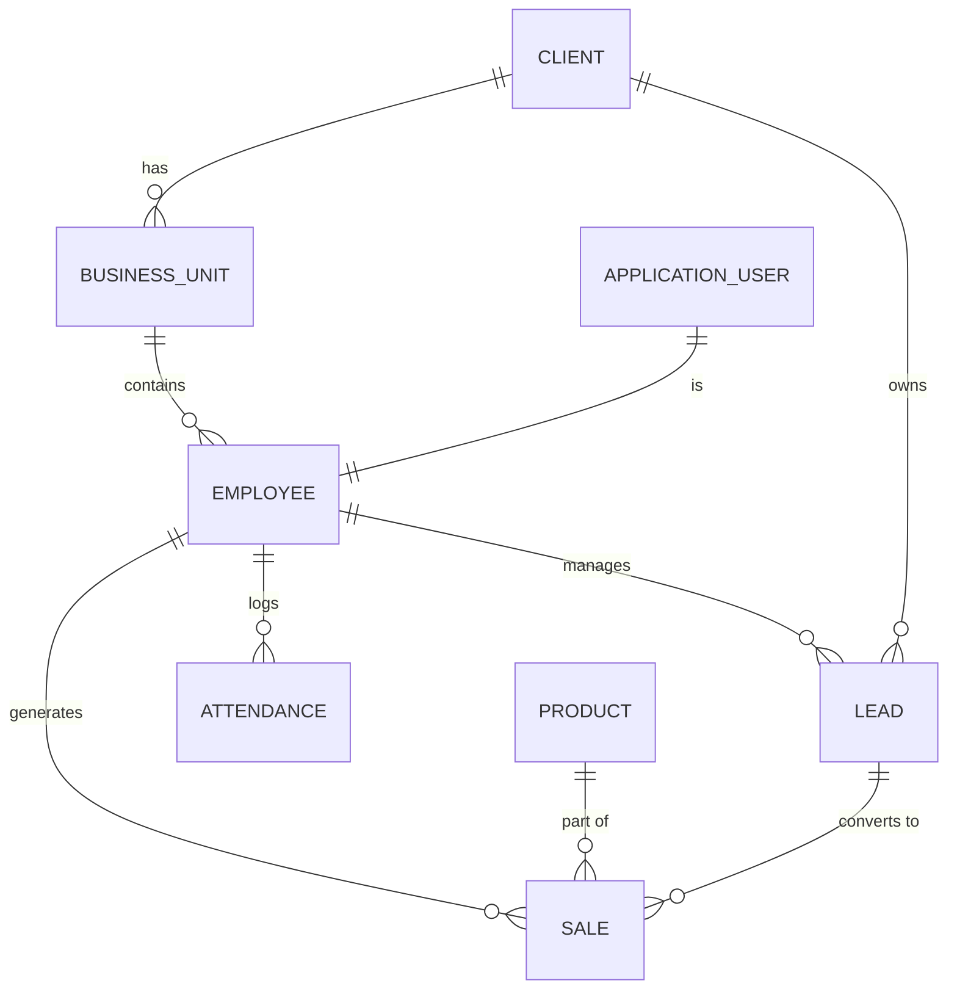

# Database Documentation

## Overview
The Sales Booster CRM uses Entity Framework Core (Code-First) mapped to a Microsoft SQL Server database. All custom entities inherit from `BaseEntity`, which implies standard fields like `Id` (Guid), `CreatedAt`, `UpdatedAt`, `CreatedBy`, and `UpdatedBy`.

## Core Entity Inventory

| Table/Entity | Purpose | Important Columns | Relationships | Notes |
|---|---|---|---|---|
| `ApplicationUser` | Identity system users. | Email, PasswordHash, IsActive | 1:1 with Employee. 1:Many Roles. | Inherits `IdentityUser<Guid>`. |
| `Employee` | Core HR and hierarchy tracking. | UserId, Designation, ManagerId, TrackLocation, BusinessUnitId | Belongs to BusinessUnit, Division. | Holds selfie and location tracking flags. |
| `Client` | Represents a customer company. | Name, Address, ContactEmail, PrimaryUserId | Has many BusinessUnits. | Core entity for multi-tenancy. |
| `BusinessUnit` | Org structure below Client. | Name, ClientId | Has many Employees, Leads. | |
| `Lead` | Prospective customer. | Name, Mobile, Status, EmployeeId, LeadCompanyCategoryId | Belongs to Employee, BusinessUnit, Client. | Status is an Enum (`LeadStatus`). |
| `Sale` | Recorded sales transaction. | SaleNumber, TransactionAmount, ProductId, EmployeeId | Belongs to Employee, Product, Client. | Links to `Collection`s. |
| `Product` | Items being sold. | Name, CategoryId | Belongs to Category. | |
| `Attendance` | Core physical check-in data. | CheckInTime, CheckOutTime, Lat/Long, TotalHoursWorked | Belongs to Employee. | |
| `EmployeeAttendance` | Processed daily attendance status. | Date, AttendanceStatus, IsLate, PayableHours | Links to `Attendance`, `Shift`. | Status: Present, Absent, HalfDay, etc. |
| `Message` | Chat system message. | Content, SenderId, ChannelId | Belongs to Channel/Conversation. | High volume table. |
| `TaskItem` | General to-do or follow-up. | Title, DueDate, IsCompleted | Belongs to Employee. | Used for follow-ups. |
| `MonthlySalesTarget`| Sales goals. | TargetAmount, Month, Year, EmployeeId | | |
| `RecentActivity` | Audit logging. | Action, EntityName, EntityId, UserId | | Tracks high-level changes. |

## Entity Relationship Diagram (ERD) - High Level

## Indexes and Performance
- **Primary Keys**: All tables use `Guid` as the Primary Key (`Id` column via `BaseEntity`).
- **Foreign Keys**: Strongly defined via EF Core conventions and Fluent API.
- **Missing Indexes**: Based on typical query patterns, composite indexes on `(EmployeeId, Date)` in `EmployeeAttendance` and `(ClientId, Status)` in `Lead` should be explicitly verified or added if missing, as these will be heavily filtered in dashboards.

## Audit and Soft Delete
- Soft delete is not explicitly mandated across all entities (no `IsDeleted` on `BaseEntity` found directly), but the presence of `IsActive` on `User` suggests some logical deletion.
- Audit fields (`CreatedAt`, `UpdatedAt`) exist on all entities inheriting `BaseEntity`.

## Suggested Improvements
1. **Chat Table Partitioning**: The `Message` and `MessageReaction` tables will grow exponentially. Consider SQL Server Table Partitioning by Month/Year.
2. **Soft Delete Interface**: Implement an `ISoftDelete` interface and apply EF Core Global Query Filters (`query.Where(e => !e.IsDeleted)`) to prevent accidental hard deletion of financial records (`Sale`, `Collection`).
