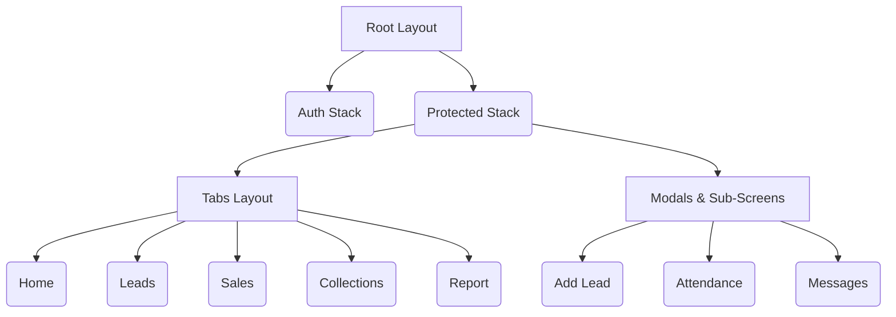

# Sales Booster Mobile App Documentation

## 1. Mobile App Overview
The Sales Booster Mobile App is designed for field sales executives and agents. It provides on-the-go access to CRM and HR functions, allowing users to track leads, log sales, record expenses, chat with team members, and check in/out of work using geolocation tracking.
- **Target Users**: Field Sales Executives, Agents, Delivery Staff.
- **Supported Platforms**: Android and iOS.
- **Relationship with Backend**: Consumes the same .NET 8 API as the web frontend, utilizing token-based authentication and SignalR for real-time chat.

## 2. Technology Stack
- **Framework**: React Native (via Expo SDK 54).
- **Navigation**: Expo Router (File-based routing).
- **State Management**: React Hooks (Custom hooks per feature).
- **Styling**: NativeWind (TailwindCSS for React Native).
- **API Client**: Custom `fetch` wrapper (`ApiService.ts`) with automatic token refresh.
- **Storage**: `@react-native-async-storage/async-storage`.
- **Location**: `expo-location` (with background tracking via `expo-task-manager`).
- **Notifications**: `expo-notifications`.
- **UI Components**: `react-native-paper`, `react-native-maps`, `@expo/vector-icons`.
- **Build Tools**: EAS (Expo Application Services) / Prebuild.

## 3. Folder Structure
- `app/`: Expo Router configuration. Contains route definitions like `_layout.tsx`, `(tabs)`, and individual screen wrappers.
- `features/`: The core logic, separated by module (e.g., `auth`, `lead`, `home`, `messages`, `sales`, `attendance`).
  - Each feature folder contains `components`, `hooks`, and `screens`.
- `services/`: Contains `ApiService.ts` which handles the API calls and JWT refresh logic.
- `utils/`: Helpers for storage, formatting, `CaptureSelfie`, and `backgroundTracking`.
- `scripts/`: Custom node scripts for build configurations.

## 4. Screens Inventory

| Screen | Route/Navigation Name | Purpose | API Used | Auth Required | Status |
|---|---|---|---|---|---|
| Home | `(tabs)/home` | Mobile dashboard, Quick Actions, recent activities. | Dashboard APIs | Yes | Implemented |
| Leads | `(tabs)/leads` | List of assigned leads. | `/api/leads` | Yes | Implemented |
| Sales | `(tabs)/sales` | List of sales. | `/api/sales` | Yes | Implemented |
| Collections | `(tabs)/collections` | List of collections. | `/api/salecollections` | Yes | Implemented |
| Report | `(tabs)/report` | Mobile reports and analytics. | Reporting APIs | Yes | Implemented |
| Login | `auth/index` | Authenticate user. | `/api/Auth/login` | No | Implemented |
| Add Lead | `AddLeadscreen` | Form to create a new lead. | `/api/leads` (POST) | Yes | Implemented |
| Add Sale | `AddSaleScreen` | Form to create a sale. | `/api/sales` (POST) | Yes | Implemented |
| Attendance | `AttendanceScreen` | Check-in/out with location & selfie. | `/api/attendance` | Yes | Implemented |
| Messages | `messages/index` | Chat interface. | SignalR / Messaging | Yes | Implemented |
| Expense | `AddExpenseScreen` | Log expenses with receipt photo. | `/api/expense` | Yes | Implemented |
| Profile | `profile` | User details and app settings. | User API | Yes | Implemented |

## 5. Feature Mapping

| CRM Module | Mobile Support | Screens Found | APIs Used | Gap |
|---|---|---|---|---|
| User Auth | Yes | Login, Profile | Auth API | No "Forgot Password" flow visible in main stack. |
| Attendance | Yes | AttendanceScreen | Attendance API | Uses GPS and Selfie (`CaptureSelfie.ts`). |
| Leads | Yes | Leads, AddLead, Details | Leads API | No pipeline/kanban view for mobile. |
| Sales | Yes | Sales, AddSale | Sales API | Basic list only. |
| Chat | Yes | Messages | Messaging API | Attachments might be heavy on mobile data. |
| Expense | Yes | ExpensesScreen, Add | Expense API | Fully supported. |
| Dashboard | Yes | Home | Dashboard API | Summarized for mobile view. |

## 6. Authentication Flow
- **Login Screen**: Takes credentials, calls API.
- **Token Storage**: `accessToken` and `refreshToken` are stored securely in `AsyncStorage`.
- **Session Expiry**: Intercepted in `ApiService.ts`. If a 401 occurs, it automatically calls `/api/Auth/refresh`.
- **Logout**: Handled via `logoutHelper.ts`, clears storage, and redirects to Login.

## 7. API Integration
- **Base URL**: Managed via `app.config.js` and `Constants.expoConfig.extra.apiUrl`.
- **Service Files**: Each feature has custom hooks (e.g., `useLeads.tsx`) that utilize the `apiFetch` wrapper.
- **Error Handling**: Basic try-catch blocks. If token refresh fails, user is forcibly logged out.

## 8. Navigation Architecture

## 9. Offline and Sync Readiness
- **Offline Support**: Missing. The app relies directly on live API calls via `fetch`.
- **Local Caching**: AsyncStorage is used for tokens, but no robust data caching (like WatermelonDB or SQLite) is found for leads or sales.
- **Sync Queue**: Not implemented. If network fails during Check-In or Add Lead, it throws an error instead of queuing for later.
- **Recommendation**: Implement `NetInfo` and local SQLite storage for a sync queue, critical for field agents in low-network areas.

## 10. Notifications
- **Push Notifications**: `expo-notifications` is installed. Expected to receive alerts for new leads, chat messages, and shift reminders.
- **Follow-up Reminders**: Local notifications are not explicitly scheduled in the code.
- **Recommendation**: Implement local push notifications for scheduled lead follow-ups.

## 11. UI/UX Review
- **Mobile Usability**: Built with NativeWind ensuring responsive Flexbox layouts.
- **Field Staff Workflow**: Quick actions on the Home screen (Check-in, Add Lead) are perfectly tailored for field staff.
- **Missing Improvements**: Maps integration (`react-native-maps`) is present, but route optimization for daily client visits is missing.

## 12. Security Review
- **Token Storage**: Uses standard `AsyncStorage`. While functional, upgrading to `expo-secure-store` is highly recommended for storing JWTs securely.
- **Location Tracking**: Background tracking exists (`backgroundTracking.ts`). Requires stringent App Store privacy disclosures.
- **Input Validation**: Uses basic state checks.

## 13. Build and Deployment
- **Expo Framework**: Eases both Android and iOS builds.
- **Build Commands**: Available via `package.json` (`npm run android:release-apk-expo`).
- **Configuration**: `app.config.js` handles environment variables and plugin setups (e.g., Maps API keys, Notification icons).

## 14. Testing Recommendations
- **Unit Testing**: Add Jest tests for the custom hooks (`useLeads`, `useAuth`).
- **E2E Testing**: Add Detox or Maestro for end-to-end testing of the Check-In and Add Lead workflows.
- **Device Testing**: GPS and Camera features MUST be tested on physical Android and iOS devices, not just simulators.

## 15. Missing Mobile Features

| Feature | Business Value | Backend Impact | Mobile Impact | Priority | Complexity |
|---|---|---|---|---|---|
| Offline Lead Capture | Agents can work in remote areas | Sync API needed | SQLite / Queue setup | High | High |
| Route Planning | Optimize agent travel time | Map API / TSP Algo | UI for daily route map | Medium | High |
| Call/WhatsApp integration | Direct 1-click contact logging | Call log API | Deep linking to dialer | High | Low |
| Business Card Scan | Fast lead entry | OCR API endpoint | Camera OCR library | Medium | High |
| Voice Notes | Fast activity logging | Audio upload API | Audio recorder UI | Medium | Medium |
