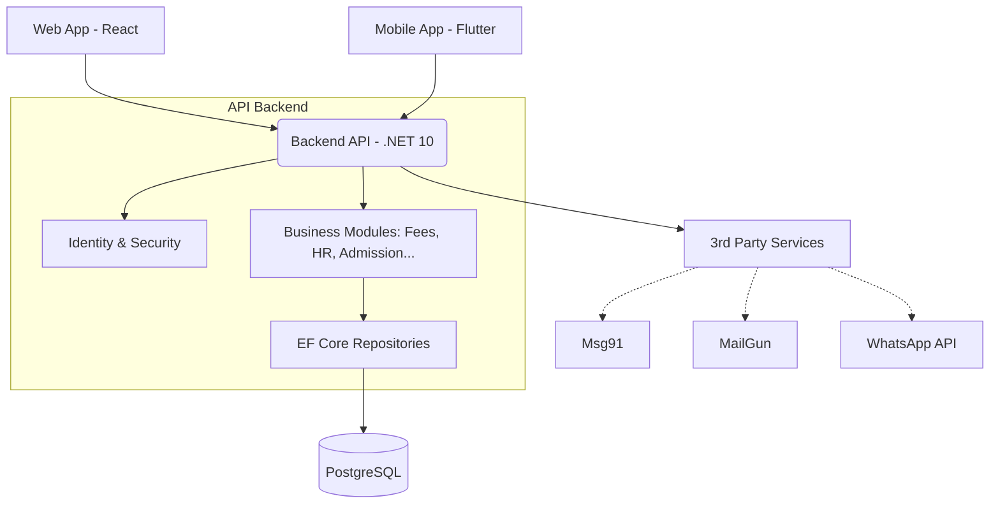
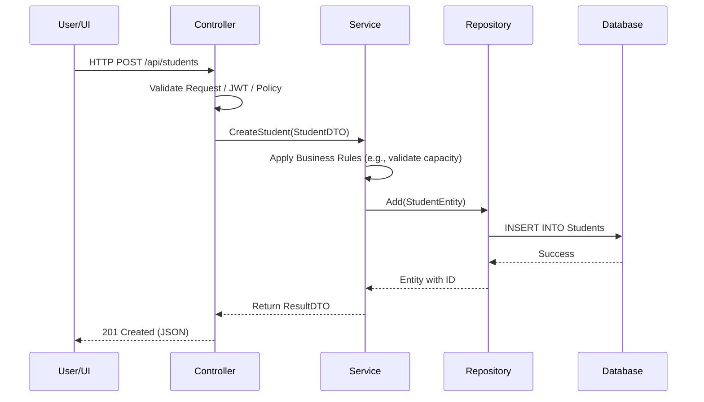
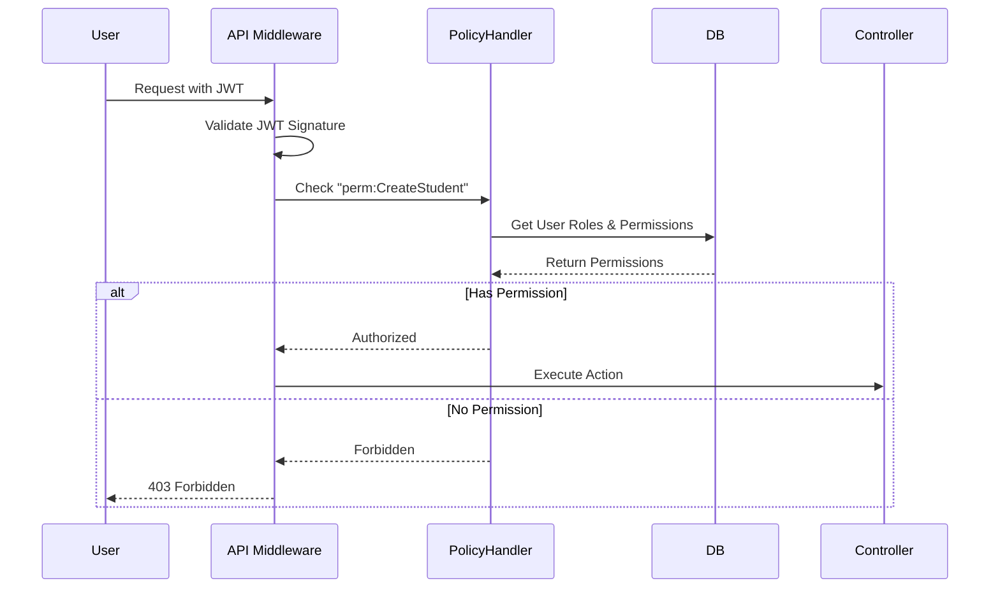

# Technical Architecture

## 1. System Overview
The School ERP system is a modern, cloud-native, multi-tenant application designed to manage the end-to-end operations of educational institutions. It utilizes a layered architectural approach to ensure separation of concerns, scalability, and maintainability.

## 2. Architecture Style
- **Backend:** Monolithic API with a Modular structure. Built using **.NET Core 10**. Uses the Repository-Service pattern.
- **Frontend:** Single Page Application (SPA) built with **React 19** and **Vite**.
- **Mobile:** Cross-platform application built using **Flutter**.
- **Database:** Relational database utilizing **PostgreSQL** (via Npgsql) with Entity Framework Core (EF Core) as the ORM.

## 3. Backend Architecture
The backend is structured into domain-driven modules (e.g., `Modules/Admission`, `Modules/Fees`, `Modules/HR`).
- **Controllers:** Handle HTTP requests, validate inputs, and return DTOs.
- **Services:** Contain the core business logic.
- **Repositories:** Abstract database access. Generic repositories (`IGenericRepository`) are used alongside specific ones.
- **Core/Infrastructure:** Contains shared utilities, exceptions, middlewares, and configurations.
- **Security:** JWT Bearer authentication and granular policy-based Authorization (`PermissionRequirement`).

## 4. Frontend Architecture
- **Framework:** React.js with TypeScript.
- **Build Tool:** Vite for fast HMR and optimized builds.
- **Styling:** Tailwind CSS for utility-first styling.
- **State Management:** React Context API / Custom Hooks (e.g., fetching data via Axios).
- **Structure:** Module-based page routing, reusable UI components (`src/components`), and API service wrappers (`src/services`).

## 5. Mobile Architecture
- **Framework:** Flutter (Dart).
- **State Management:** Riverpod.
- **Network Layer:** Dio with Retrofit for type-safe API calls.
- **Local Database:** Isar (for offline caching, e.g., calendar/timetable).
- **Structure:** Feature-first folder structure.

## 6. Database Architecture
- **RDBMS:** PostgreSQL.
- **Multi-Tenancy:** Implemented logically using a `BranchId` or `ClientId` on relevant tables. Global query filters in EF Core ensure data isolation.
- **Soft Deletes:** Tables utilize `IsDeleted` flags to prevent accidental data loss.
- **Migrations:** Managed via EF Core Migrations or custom SQL scripts (`Scripts/`).

## 7. Diagrams

### High-Level Architecture Diagram

### Request Flow Diagram

### Role & Permission Authorization Flow

## 8. File Upload Flow
Files (images, documents) are handled via standard multi-part form requests.
- Saved locally to `wwwroot/uploads/`.
- Accessible publicly (or securely based on configuration) via the `/uploads` path.
- Future Architecture: Migrate to Cloud Storage (AWS S3, Azure Blob) for scalability.

## 9. Deployment Architecture
- **Containerization:** Docker (`Dockerfile` for API and Web) and `docker-compose.yml` for orchestration.
- **Reverse Proxy:** Nginx (frontend/routing).
- **Database Hosting:** Managed PostgreSQL (e.g., AWS RDS, Azure Database for PostgreSQL).

## 10. Security Architecture
- **Authentication:** JWT tokens with expiration.
- **Authorization:** Granular Policy-based checks (`[Authorize(Policy = "perm:ManageFees")]`).
- **CORS:** Configured to allow specific origins.
- **Data Isolation:** EF Core Global Query filters ensure users only see data for their assigned `BranchId`.

## 11. Scalability Considerations
- The stateless API allows for horizontal scaling (adding more backend instances behind a load balancer).
- Memory Cache (`IMemoryCache`) is used for frequently accessed data (like permissions). Consider migrating to Redis (`IDistributedCache`) for multi-instance deployments.

## 12. Current Technical Debt
- Local file storage (`wwwroot`) is not horizontally scalable.
- Heavy reliance on manual `appsettings.json` configurations across environments.
- Lack of a robust message broker (e.g., RabbitMQ, Kafka) for asynchronous tasks like heavy report generation or mass notifications.
