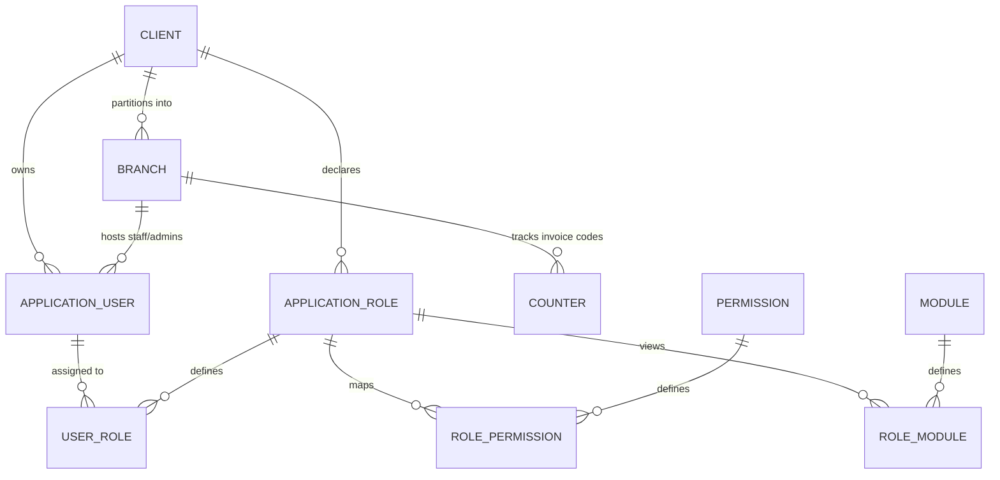
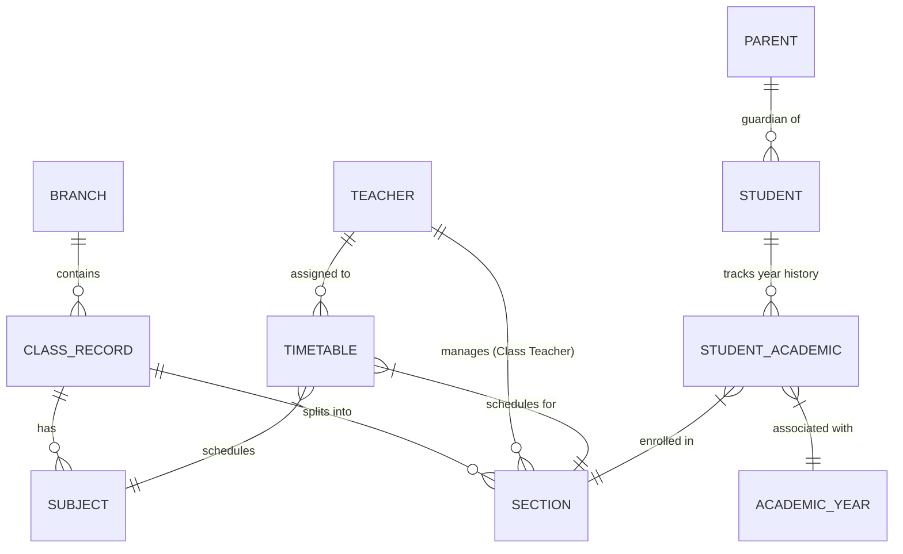
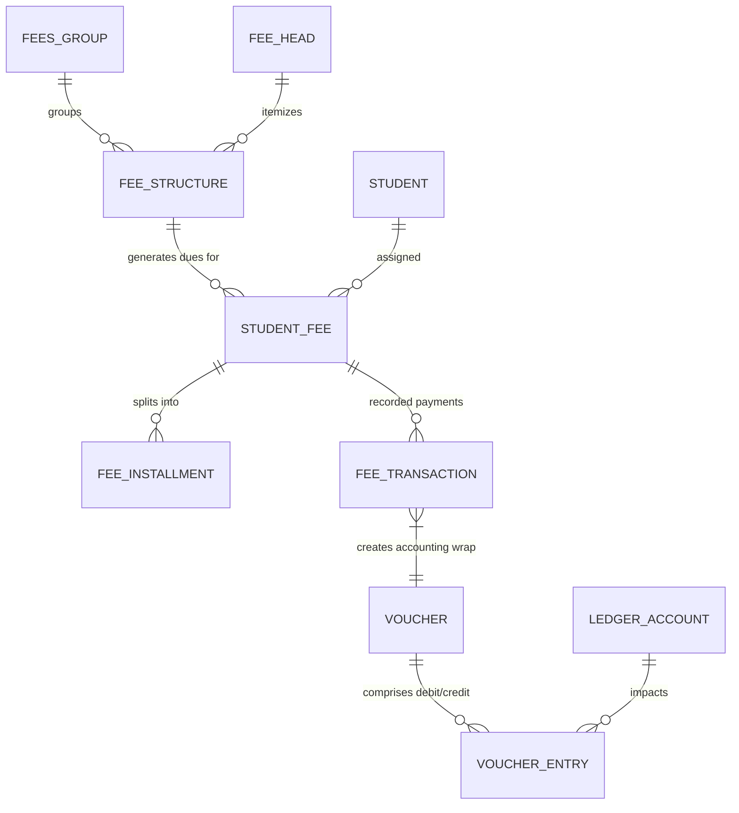
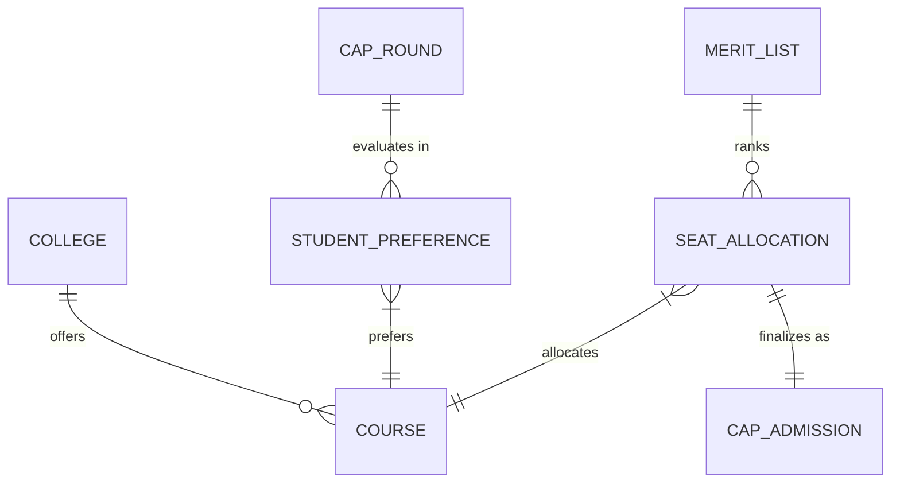

# Database Design & Architecture (Kaksha+ School ERP)

This document provides a comprehensive, reverse-engineered database schema and architectural specification for the **Kaksha+ School ERP** platform. It describes the entities, table relationships, domain modules, multi-tenant isolation, auditing patterns, and technical optimizations.

---

## 1. Architectural Foundations & Patterns

The platform is designed as an Enterprise-grade B2B SaaS system utilizing **PostgreSQL** as its relational database. The system implements a shared-database, shared-schema multi-tenant design pattern with several operational interceptors.

### 1.1 Multi-Tenant Isolation
Operational data isolation is achieved logically using standard database discriminators rather than physical database separation:
* **`ClientId`**: Represents the top-level corporate tenant or educational trust (e.g., an entire system client with multiple campuses).
* **`BranchId`**: Represents individual schools, institutes, or campuses operating under a specific Client.

To guarantee security and eliminate the risk of cross-tenant data leakage, the backend utilizes EF Core **Global Query Filters** inside the [ApplicationDbContext.cs](file:///d:/tmk-computers/products/school/api/Persistence/ApplicationDbContext.cs). These filters are automatically appended to all incoming queries at database level.

```csharp
// Multi-Tenant and Branch filter registration in ApplicationDbContext
if (typeof(IMultiTenant).IsAssignableFrom(entityType.ClrType))
{
    var parameter = Expression.Parameter(entityType.ClrType, "e");
    var property = Expression.Property(parameter, nameof(IMultiTenant.ClientId));
    var filterValue = Expression.Property(Expression.Constant(this), nameof(CurrentClientId));
    var combinedBody = Expression.OrElse(Expression.Equal(filterValue, Expression.Constant(Guid.Empty)), Expression.Equal(property, filterValue));
    builder.Entity(entityType.ClrType).HasQueryFilter(Expression.Lambda(combinedBody, parameter));
}

if (typeof(IBranchFilter).IsAssignableFrom(entityType.ClrType))
{
    var parameter = Expression.Parameter(entityType.ClrType, "e");
    var property = Expression.Property(parameter, nameof(IBranchFilter.BranchId));
    var filterValue = Expression.Property(Expression.Constant(this), nameof(CurrentBranchId));
    var combinedBody = Expression.OrElse(Expression.Equal(property, Expression.Constant(null, typeof(Guid?))), Expression.OrElse(Expression.Equal(filterValue, Expression.Constant(null, typeof(Guid?))), Expression.Equal(property, filterValue)));
    builder.Entity(entityType.ClrType).HasQueryFilter(Expression.Lambda(combinedBody, parameter));
}
```

### 1.2 Auditing & Base Entities
Every entity class implements the **`IBaseEntity`** interface (derived from [BaseEntity.cs](file:///d:/tmk-computers/products/school/api/Core/Entities/BaseEntity.cs)) which automatically manages standard operational audit fields:
* `CreatedBy` (string/Guid) & `CreatedAt` (timestamp)
* `UpdatedBy` (string/Guid) & `UpdatedAt` (timestamp)
* `IsActive` (boolean)

These fields are populated in an overridden **`SaveChangesAsync`** hook in `ApplicationDbContext.cs`, completely abstracting audit management from application controllers.

### 1.3 Soft Deletes & Temporal Tracking
Historical and financial data integrity is preserved using Soft Deletes.
* `IsDeleted` (boolean) is verified by global filters.
* Re-seeding and maintenance utilities clear records via physical SQL execution when explicitly requested in non-production, while actual production transactions are flagged with soft deletes.

---

## 2. Business Entity Schema by Module

The database houses over 100 unique operational tables, grouped logically into 13 business domain modules.

### 2.1 Tenant & SaaS Subscription Billing
Governs the core multi-client onboarding, branch indexing, and subscription billing systems.
* **`Client`**: Top-level entity representing the parent institution or trust (linked 1-to-N with branches and system users).
* **`Branch`**: Represents physical school campuses, colleges, or administrative zones.
* **`SubscriptionPlan`**: Represents SaaS subscription tiers (Standard, Premium, Enterprise).
* **`PricingSlab`**: Defines granular tier pricing rules based on student/staff counts.
* **`BranchSubscription`**: Links a `Branch` to an active `SubscriptionPlan`.
* **`Invoice`**: Stores subscription charges, payment receipts, and payment status for Client billing.
* **`Counter`**: Maintains alphanumeric sequential invoice and serial counters unique to each branch.

### 2.2 Identity & Role-Based Access Control (RBAC)
Extends ASP.NET Core Identity to provide dynamic permissions mapping.
* **`ApplicationUser`**: System-wide login profiles (linked to unique designations, departments, branches, and clients). Supports sub-reporting chains through a self-referencing `ManagerId` configuration.
* **`ApplicationRole`**: Role models (e.g., `Teacher`, `Parent`, `Student`, `SuperAdmin`). Enforces a unique index constraint partitioned by `ClientId` so clients can declare customized roles.
* **`Permission`**: System actions mapping (e.g., `system.bulk.import`).
* **`RolePermission`**: M-to-N join table between roles and permissions.
* **`Module`**: System menus and sidebar navigation nodes with parent-child hierarchical relations.
* **`RoleModule`**: Maps system menus to dynamic roles.
* **`ApplicationUserRefreshToken`**: Stores cryptographic refresh tokens for active JSON Web Token sessions.

### 2.3 Academics & Higher Ed Course Structure
Manages standards, course curricula, sections, timetables, and college-level academic divisions.
* **`AcademicYear`**: Defines administrative sessions (e.g., `2024-2025`).
* **`Department`**: Structural divisions (e.g., Science, Commerce, Administration).
* **`Class`**: Academic grades/standards in schools.
* **`ClassRoom`**: Physical classrooms with capacity tracking.
* **`Section`**: Grade divisions (e.g., Class 10th - Section B). Linked to `Class` and assigned to a class `Teacher`.
* **`Subject`**: Academic disciplines linked to classes/sections.
* **`Teacher`**: Instructor profiles representing users mapped to dynamic subjects, sections, and class timetables.
* **`ClassRoutine`**: Detailed structural routines for sessions.
* **`TimeTable`**: Weekly class timing blocks mapping Teachers, Subjects, Classrooms, and Sections.
* **`AcademicStructure`**: Dynamic configuration for high-level structures (Courses, Branches, Semesters, Batches) tailored specifically for Higher Education / College installations.

### 2.4 Demographics, Students & Admissions
Tracks student demographic histories, documentation, parental links, and enrollment inquiries.
* **`Parent`**: Master profiles for student guardians (linked in 1-to-N relation with students).
* **`Student`**: Comprehensive profiles storing admission numbers, date of birth, current class/section, parent link, transport routing, and biometric identifiers.
* **`StudentDocument`**: Attachment files linked to student records (such as local transfers, certificates, and identification).
* **`StudentAcademic`**: Historical ledger tracking a student's class, section, and academic year history.
* **`AdmissionInquiry`**: Front-office prospect log capturing potential admissions.
* **`AdmissionApplication`**: Registration records submitted by applicants.
* **`AdmissionDocument`**: Uploaded student admissions attachments.
* **`Category`**: Stores organizational categories (e.g., General, Sports Quota, OBC, SC/ST).
* **`Address`**: Universal schema to bind multi-purpose geographic addresses.

### 2.5 Ledger Account, Billing & Fee management
Handles automated installment structures, student fee liabilities, concession workflows, and double-entry general ledgers.
* **`FeeHead`**: Specific fee heads (e.g., Tuition, Sports Fee, Bus Fee).
* **`FeesGroup`**: Groupings of FeeHeads for standardized assignments.
* **`FeeStructure`**: Templates containing FeeHeads mapped to specific academic standards.
* **`StudentFee`**: Core transaction matrix containing student fee requirements.
* **`FeeInstallment`**: Configures multi-phase payment deadlines.
* **`FeeTransaction`**: Detailed payment transactions, credit listings, and issued receipts.
* **`FeeConcessionRequest`**: Fee waiver or discount approval processes.
* **`FeeFine`**: Automatically generated late-payment penalties.
* **`LedgerAccount`**: Double-entry bookkeeping ledger nodes (Assets, Liabilities, Income, Expenses).
* **`Voucher`**: Journal voucher wraps representing financial events.
* **`VoucherEntry`**: Individual Debit/Credit ledger balance entries.
* **`Payment`**: Records real-time payment gateway transactions.

### 2.6 Human Resources & Payroll
Controls staff demographics, leave allowances, timesheets, and payslips.
* **`Staff`**: Employee records storing bank accounts, PF listings, and employment states.
* **`Designation`**: Formal employment job titles (e.g., Clerk, Principal, Peon).
* **`LeaveType`**: Configured leave categories (Sick Leave, Casual Leave, Paid Leave).
* **`Holiday`**: Holidays declared by administration.
* **`StaffAttendance`**: Daily clock-in/out logs for payroll calculation.
* **`Payroll`**: Aggregated monthly payslips, base salary configurations, deductions, and payment states.
* **`RoleWiseCompensation`**: Salary formulas mapped to specific employee designations.

### 2.7 Curriculum & Academic Progress
Maps syllabus status and student homework.
* **`Board`**: Affiliation boards (CBSE, ICSE, Cambridge, State Board).
* **`Syllabus`**: Curriculum outline grouped by Class and Subject.
* **`SyllabusTopic`**: Nested chapters and sub-topics.
* **`SchoolSyllabusMapping`**: Maps specific syllabus blocks to sections.
* **`Homework`**: Daily and weekly tasks posted by teachers.
* **`HomeworkSubmission`**: Student uploaded files and marks.

### 2.8 Examinations & Online Portal
Exhaustive module spanning physical exams, hall tickets, seating plans, grading, and online quiz engines.
* **`ExamCategory`**: Exam categories (Term Exams, Unit Tests).
* **`ExamGroup`**: Wraps related exams for aggregated progress reports.
* **`Exam`**: Individual subject exams.
* **`ExamSchedule`**: Precise date, time, duration, and classroom mapping.
* **`ExamMark`**: Score log mapping students to specific exams and subjects.
* **`Result`**: Final grade and score aggregates.
* **`TabulationSheet`**: Matrix worksheets showing a summary of grades across terms.
* **`AdmitCard`**: Exam hall authorization tickets.
* **`ExamSeatingArrangement`**: Generates exam seating layouts in physical halls.
* **`QuestionBank`**: Multi-format test question bank.
* **`OnlineExamConfig`**: Parameters for online examinations (timer, restrictions).
* **`StudentExamAttempt`**: Records online exam attempts.
* **`StudentExamAnswer`**: Granular database containing individual question responses.
* **`OnlineExamResult`**: Real-time computed results for online examinations.

### 2.9 Hostel & Transport Facilities
Dormitory allocation and school bus route systems.
* **`Hostel`**: Master dorm configurations with location and capacity details.
* **`HostelRoomType`**: Room pricing categories (AC, Non-AC, Shared).
* **`HostelRoom`**: Individual hostel rooms with capacity indices.
* **`HostelAllocation`**: Logs mapping students to active rooms.
* **`HostelAttendance`**: Daily curfew and evening roll-calls.
* **`HostelRoomSwapRequest`**: Dynamic swap workflows for residents.
* **`TransportRoute`**: Geographic routes with source/destination markers.
* **`TransportVehicle`**: School bus asset details (insurance, pollution dates).
* **`TransportStop`**: Stops on route with associated fee prices.
* **`TransportAllocation`**: Mappings assigning students to buses and stops.
* **`TransportFuel`**: Fuel log monitoring bus expenditures.
* **`TransportMaintenance`**: Logs for routine maintenance and repair costs.

### 2.10 Inventory & Supply Management
Tracks storage inventory, item issues, and procurement.
* **`Supplier`**: Registered vendors and procurement suppliers.
* **`ItemCategory`**: Stock classifications (Stationery, Lab Equipment, Sports Goods).
* **`InventoryItem`**: Individual inventory catalog items.
* **`ItemStockLog`**: Detailed transaction logs tracking stock additions and removals.
* **`ItemIssue`**: Stock items assigned to employees or student departments.

### 2.11 Library Automation
System tracking shelf catalogs, cards, checkouts, and late renewals.
* **`LibrarySetting`**: Configuration details (maximum loan counts, late fee daily rules).
* **`LibraryMember`**: Library membership profiles mapped to student/staff records.
* **`Book`**: Book details (ISBN, author, rack number, available copy count).
* **`BookIssue`**: Checkout records (issue dates, expected returns).
* **`BookReservation`**: Book hold list.
* **`BookRenewal`**: Extends return dates.

### 2.12 Communication, Alerts & CRM Front-Office
Handles SMS notifications, global notice boards, visitor check-ins, and automated payment reminders.
* **`Visitor`**: Visitor records (host staff, visitor photos, entry/exit logs).
* **`PhoneCallLog`**: Front-office call summaries.
* **`PostalLog`**: Physical correspondence tracking.
* **`NoticeBoard`**: Dynamic announcements targeted to parents, teachers, or students.
* **`NotificationTemplate`**: Pre-built message templates (SMS/Email/WhatsApp).
* **`CommunicationLog`**: Outgoing notification logs.
* **`WhatsAppConfiguration`**: Integration parameters for official WhatsApp API channels.
* **`FeeNotification`**: Notification triggers linked to fee events.
* **`FeeReminderConfig`**: Schedules for sending automated outstanding fee reminders.

### 2.13 Biometrics Synchronization
Integrates physical fingerprint/facial check-in terminals.
* **`BiometricDevice`**: Network parameters for physical biometric machines.
* **`BiometricUserMapping`**: Maps a student/staff database ID to the machine's local template ID.
* **`BiometricPunchLog`**: Logs incoming raw punch logs.

### 2.14 CAP Admission (Higher Ed / Centralized Counseling)
Centralized Admission Process engine used to execute counseling and allocation routines.
* **`College`**: Listing of participating collegiate campuses.
* **`Course`**: Specialized college degrees (e.g., B.Tech Computer Science).
* **`CapRound`**: Counseling allocation rounds.
* **`StudentPreference`**: Ordered preference lists submitted by applicants.
* **`MeritList`**: Ranks based on test scores.
* **`SeatAllocation`**: Generated assignments.
* **`CapAdmission`**: Confirmed enrollments.

---

## 3. High-Resolution Entity Relationship Diagrams (ERD)

The following diagrams illustrate the core relationship structures in the database:

### 3.1 Multi-Tenancy & Authorization Flow
Manages client segregation, users, and permissions.



### 3.2 Academics & Student Enrollment
Primary matrix connecting students, classes, sections, and subjects.



### 3.3 Financial Ledger & Billing Operations
Financial matrix connecting invoices, student dues, fee structures, and transactional accounts.



### 3.4 Centralized College Admission (CAP)
Centralized counseling and seat allocation workflows.



---

## 4. Key Relational Integrity Constraints & Indexing

To ensure quick retrieval and maintain referential integrity under heavy multi-tenant database loads, the following physical database conventions are applied:

1. **Composite Tenant Indexes**:
   Non-clustered indexes must be applied to the primary operational foreign keys:
   * **`BranchId + ClassId + SectionId`** on table `Students`.
   * **`BranchId + StudentId`** on tables `StudentAttendance` and `FeeTransactions`.
   * **`ClientId + NormalizedName`** on `ApplicationRoles`.

2. **Foreign Key Deletion Constraints**:
   Referential cascade rules are configured using Fluent API configurations within `OnModelCreating` in `ApplicationDbContext.cs`:
   * **`DeleteBehavior.Restrict`** is applied to prevent parent entities from deleting active database configurations (such as standard Classes, Fee Heads, or Leave Types) if transactional student records exist.
   * **`DeleteBehavior.Cascade`** is applied only for child tables (such as `RolePermission` or `VoucherEntry`) where records have no logical purpose without their parent.
