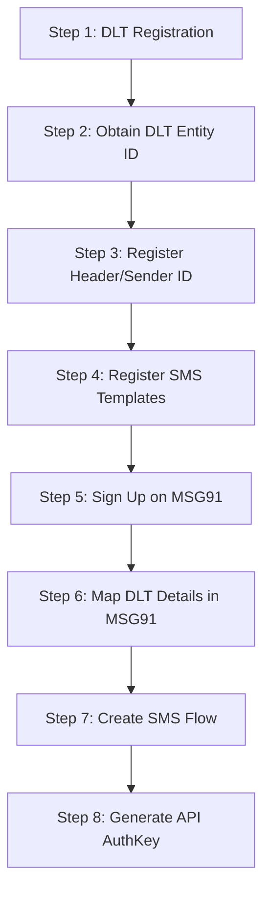
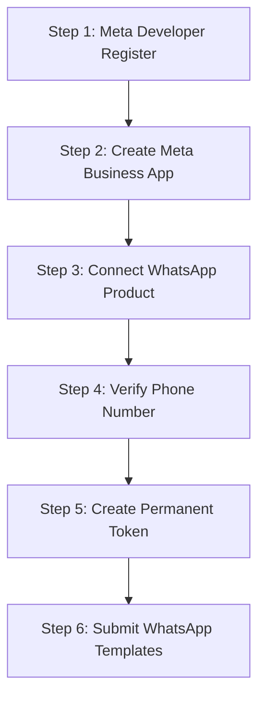

# Messaging Setup Guide: SMS (MSG91) & WhatsApp (Meta Cloud)

This guide provides a comprehensive, step-by-step walkthrough for the customer support team to provision, configure, and activate SMS (via MSG91) and WhatsApp (via Meta Cloud API) integrations for our multi-tenant School ERP system.

---

# Part 1: SMS Integration Setup (MSG91)

Since our system serves regional and Indian tenants, we must comply with Distributed Ledger Technology (DLT) regulations before sending SMS. Follow these steps sequentially:



### Step 1: DLT (Distributed Ledger Technology) Enterprise Registration
In India, telecom authorities require every business sending SMS to register on a DLT platform.
1. Visit any major telecom DLT portal:
   * **Jio DLT**: [https://trueconnect.jio.com/](https://trueconnect.jio.com/)
   * **VIL Power DLT**: [https://www.vilpower.in/](https://www.vilpower.in/)
   * **BSNL DLT**: [https://www.ucc-bsnl.co.in/](https://www.ucc-bsnl.co.in/)
2. Register as an **Enterprise**.
3. Upload business credentials (GST Registration, PAN, Shop Act, and Authorization Letter on company letterhead).
4. Pay the registration fee (~₹5,900 if applicable, though sometimes waived during campaigns).

### Step 2: Retrieve DLT Entity ID
* Once the telecom operators approve the Enterprise, log into the DLT portal and copy the **DLT Entity ID** (a 19-digit number). This is mandatory for sending all future C# API requests.

### Step 3: Register Sender ID (Headers)
A "Header" or "Sender ID" is the 6-character sender signature that appears at the top of the SMS (e.g. `ACMESC` for Acme School).
1. Inside the DLT portal, navigate to **Header Management** > **Add New Header**.
2. Select Category as **Transactional** or **Service Implicit** (use *Service Implicit* for school notifications like fee updates, attendance alerts, etc.).
3. Input a unique 6-character alphabetic code.
4. Provide a clear justification (e.g. *"ACMESC represents Acme Secondary School for student transactional alerts"*).
5. Submit for approval (usually approved within 24 to 48 hours).

### Step 4: Register DLT Content Templates
You must register every message format before sending it. 
1. In the DLT Portal, navigate to **Template Management** > **Content Template** > **Add New**.
2. Choose **Service Implicit** type.
3. Select your approved **Header / Sender ID**.
4. Draft the message using dynamic variables represented by `{#var#}`.
   * *Example:* `Dear Parent, your ward {#var#} was ABSENT on {#var#}. - Acme School`
   * *Example:* `Dear Parent, please pay the outstanding fee amount of {#var#} before {#var#}. - Acme School`
5. Submit for approval. Once approved, you will get a unique **DLT Template ID**.

---

### Step 5: Provision MSG91 Account
1. Visit [MSG91 Sign Up](https://msg91.com/) and register a business account.
2. Complete your profile, submit basic company information, and verify the email.
3. Purchase transactional SMS credits.

### Step 6: Map DLT IDs to MSG91
1. Log in to the MSG91 dashboard.
2. Navigate to **SMS** > **DLT** in the left sidebar.
3. Add your **DLT Entity ID** approved in **Step 2**.
4. Add your approved **Headers / Sender IDs** approved in **Step 3**.
5. Import or paste your approved **DLT Content Templates** with their respective **DLT Template IDs** from **Step 4**.

### Step 7: Create a Flow (Flow ID)
MSG91 utilizes "Flows" to handle dynamic template mappings cleanly:
1. In the MSG91 dashboard, go to **Flows** > **Create Flow**.
2. Give it a name (e.g. `Attendance_Alert_Flow`).
3. Select the approved **DLT Template** you want to map.
4. Define variables: map variables like `VAR1`, `VAR2` in the Flow editor to represent values like `{studentName}` or `{date}`.
5. Save the Flow and copy the generated **Flow ID** (e.g. `65fcdb480b85ea0ad...`).

### Step 8: Generate API AuthKey
1. Go to the **API** section in the MSG91 dashboard.
2. Click **Create New AuthKey**.
3. Copy this secret key immediately.

### Step 9: Configure `appsettings.json`
Provide the support details to your deployment engineer to plug into `appsettings.json`:
```json
  "Msg91": {
    "AuthKey": "YOUR_MSG91_AUTH_KEY",
    "FlowId": "YOUR_MSG91_FLOW_ID"
  }
```

---
---

# Part 2: WhatsApp Integration Setup (Meta Cloud API)

To configure the Meta Cloud API for sending automated WhatsApp text and media updates, perform the following steps:



### Step 1: Register as a Meta Developer
1. Go to the [Meta for Developers Portal](https://developers.facebook.com/).
2. Log in using your company Facebook credentials.
3. Register as a Meta Developer by accepting the Terms of Service.

### Step 2: Create a Meta App
1. Go to the **My Apps** dashboard.
2. Click **Create App** in the top right.
3. Choose the app type: **Other** or **Business** (choose *Business* for WhatsApp integrations).
4. Fill in the App Display Name (e.g. `School ERP Messaging`) and connect your existing **Meta Business Account** (mandatory for production).
5. Click **Create App**.

### Step 3: Add WhatsApp Product
1. Scroll down to the list of available products in the app dashboard.
2. Find **WhatsApp** and click **Set Up**.
3. Select or create a Meta Business Portfolio to link with the App.

### Step 4: Add & Verify the WhatsApp Phone Number
1. Navigate to **WhatsApp** > **API Setup** in the left navigation sidebar.
2. In the "Step 5: Add a phone number" section, click **Add Phone Number**.
3. Input your display name, business category, and description.
4. Input the dedicated phone number.
   > [!WARNING]
   > The phone number must NOT be registered with any existing personal or business WhatsApp mobile apps. If it is, you must delete that WhatsApp account from the mobile app first.
5. Choose verification method (**SMS** or **Voice Call**) and enter the OTP.

### Step 5: Retrieve API IDs
Once the number is verified, copy the following fields from the **API Setup** dashboard:
* **Phone Number ID** (a long numeric string)
* **WhatsApp Business Account ID** (a long numeric string)

### Step 6: Generate a Permanent System User Access Token
By default, the developer console page provides a Temporary Access Token that expires in 24 hours. **Do not use this for production!** You must generate a permanent token:
1. Go to your **Meta Business Suite** > **Business Settings** ([https://business.facebook.com/settings](https://business.facebook.com/settings)).
2. Select your business portfolio.
3. Go to **Users** > **System Users** in the left menu.
4. Click **Add** to create a new System User (choose role as *Admin*).
5. Assign Assets: Select your **School ERP App** (created in Step 2) and grant **Full Control**.
6. Click **Generate New Token**.
7. Select the app from the dropdown.
8. Check the following scopes/permissions:
   * `whatsapp_business_messaging`
   * `whatsapp_business_management`
9. Click **Generate Token**.
10. Copy this token immediately and store it securely (it will never be displayed again).

### Step 7: Configure `appsettings.json`
Provide the gathered credentials to your deployment team to insert into the system's global config:
```json
  "WhatsApp": {
    "PhoneNumberId": "YOUR_PERMANENT_PHONE_NUMBER_ID",
    "BusinessAccountId": "YOUR_WHATSAPP_BUSINESS_ACCOUNT_ID",
    "AccessToken": "YOUR_PERMANENT_SYSTEM_USER_ACCESS_TOKEN",
    "VerifyToken": "my_secret_token"
  }
```

---

### Step 8: Create approved WhatsApp Templates (For template notifications)
Meta requires templates to initiate conversation threads with parents if more than 24 hours have passed since their last message.
1. Inside the Meta App Dashboard, navigate to **WhatsApp** > **Quickstart** > **Message Templates**.
2. Click **Create Template**.
3. Select your category (e.g. **Utility** for transactions) and name it (e.g. `fee_reminder_alert`).
4. Select the language (e.g. `English`).
5. Write the message body using variables like `{{1}}` for names and `{{2}}` for amounts.
   * *Example:* `Hello {{1}}, this is a reminder that the tuition fees of {{2}} for the academic year are due. Please pay soon.`
6. Click **Submit**. Meta usually reviews and approves templates automatically within 2 to 10 minutes.

---

# Part 3: Support Team Checklist for Tenant Activation

When a new school (tenant) is onboarded, the support team should use this checklist to enable custom messaging services for them:

- [ ] **Collect Requirements**: Does the school want to use the global billing platform (system-wide SMS/WhatsApp) or set up their own custom credentials?
- [ ] **If Custom WhatsApp Credentials are requested**:
  - [ ] Request their Meta `PhoneNumberId`, `AccessToken`, and `BusinessAccountId`.
  - [ ] Navigate to the **WhatsApp Configuration** module in the School Admin portal.
  - [ ] Add the credentials, input a unique webhook verification token, and click **Save**.
  - [ ] Toggle the status to **Active** to routing traffic through their custom number immediately.
- [ ] **If Custom SMS Credentials are requested**:
  - [ ] Request their custom MSG91 `AuthKey` and mapped Flow IDs.
  - [ ] Complete configuration overrides in tenant database tables.
- [ ] **DLT Template Registration**: Coordinate template drafts on behalf of the school if they are registering their own DLT headers, ensuring the syntax contains valid variable placeholders (`{#var#}` for SMS, `{{1}}` for WhatsApp).
